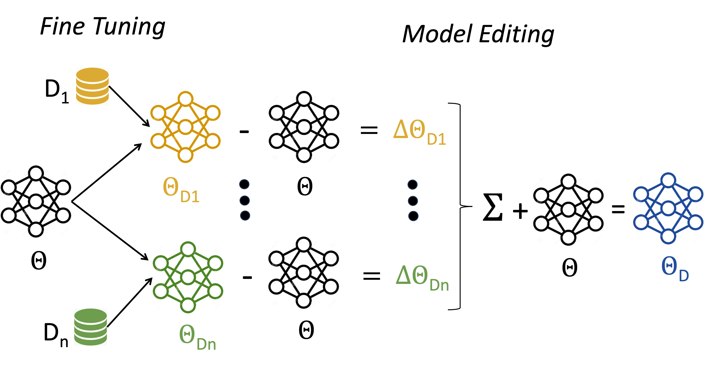

# Task Arithmetic

## Description

This repository contains the code used for experiments from: [DEM: Distribution Edited Model for Training with Mixed Data Distributions](https://aclanthology.org/2024.emnlp-main.1074/)

## Abstract

Training with mixed data distributions is a common and important part of creating multi-task and instruction-following models. The diversity of the data distributions and cost of joint training makes the optimization procedure extremely challenging. Data mixing methods partially address this problem, albeit having a sub-optimal performance across data sources and require multiple expensive training runs. In this paper, we propose a simple and efficient alternative for better optimization of the data sources by combining models individually trained on each data source with the base model using basic element-wise vector operations. The resulting model, namely Distribution Edited Model (DEM), is cheaper than standard data mixing and outperforms strong baselines on a variety of benchmarks, yielding upto 6.2% improvement on MMLU, 11.5% on BBH, 16.1% on DROP, 6% MathQA and 9.3% on HELM with models of size 3B to 13B. Notably, DEM does not require full re-training when modifying a single data-source, thus making it very flexible and scalable for training with diverse data sources.




## Installation

### Prerequisites

### Install Poetry
The project uses `poetry` for dependency management and packaging. The latest version and instructions can be
found on [https://python-poetry.org](https://python-poetry.org/docs/).

There are several ways you can install `poetry`, however the recommended way is to used the official installer:

```shell
curl -sSL https://install.python-poetry.org | python3 -
```

After you have installed poetry you need to setup an environment. For this step you will need Python 3.8.
Note, that if your OS have this version for `python3` then you can skip the next steps but you can use
a new environment as well.

### (Optional) Install the Proper Python Version

To install the proper version of Python you can use any tool such as `conda` or `pyenv`.

* For `pyenv` you can use: `pyenv install -v 3.9.X`
* For `conda` you can use: `conda create -n py38 python=3.9ls
* `

After setting up the proper version of `python` you need to install the project and its dependencies.

(Optional) You can link a python interpreter to poetry for a certain project.
Assuming you are in the root folder of the project run the following command:

```shell
poetry env use PATH_TO_PYTHON/python
```

### Install the Project

After that we can spawn a `poetry shell` that creates new or activates an existing environment for the project.

To install the dependencies you need to run `poetry install`.

## Running the model arithmetic

To run the model arithmetic the first step is to prepare a config with the formula you want to execute
and path to the models. Below is an example:

```json
### configs/example.json
{
  # Do not use `lambda` in the formula, because it breaks the parser!
  "formula": "-a + 2/3*(b - c) /2 - c",
  "models": [
    {
      # Local path or a model from the HuggingFace Hub model
      "path": "/mnt/models/openlm-research/open_llama_7b_v2-finetuned-on-a",
      "operand_id": "a",
      "weight": 1.0
    },
    {
      "path": "/mnt/models/openlm-research/open_llama_7b_v2-finetuned-on-b",
      "operand_id": "b",
      "weight": 5.0
    },
    {
      "path": "openlm-research/open_llama_7b_v2",
      "operand_id": "c",
      "weight": 1.0
    }
  ]
}
```

Note, that the paths to the models can be from the HuggingFace Hub or local ones.

When the config is prepared you can run the arithmetic using the following command:

```shell
poetry run python src/dem/model_arithmetic.py \ 
      --config-path configs/example.json \
      --output-dir models/testing \
      --cache-dir transfomers_cache
```

## References

Please cite as [[1]](https://aclanthology.org/2024.emnlp-main.1074/).


[1] Dhananjay Ram, Aditya Rawal, Momchil Hardalov, Nikolaos Pappas, and Sheng Zha. 2024. [*DEM: Distribution Edited Model for Training with Mixed Data Distributions*](https://aclanthology.org/2024.emnlp-main.1074/). In Proceedings of the 2024 Conference on Empirical Methods in Natural Language Processing, pages 19287–19301, Miami, Florida, USA. Association for Computational Linguistics.

```
@inproceedings{ram-etal-2024-dem,
    title = "{DEM}: Distribution Edited Model for Training with Mixed Data Distributions",
    author = "Ram, Dhananjay  and
      Rawal, Aditya  and
      Hardalov, Momchil  and
      Pappas, Nikolaos  and
      Zha, Sheng",
    editor = "Al-Onaizan, Yaser  and
      Bansal, Mohit  and
      Chen, Yun-Nung",
    booktitle = "Proceedings of the 2024 Conference on Empirical Methods in Natural Language Processing",
    month = nov,
    year = "2024",
    address = "Miami, Florida, USA",
    publisher = "Association for Computational Linguistics",
    url = "https://aclanthology.org/2024.emnlp-main.1074/",
    doi = "10.18653/v1/2024.emnlp-main.1074",
    pages = "19287--19301",
}
```

## License

This project is licensed under the [Attribution-NonCommercial 4.0 International (CC-BY-NC-4.0) License](LICENSE).

